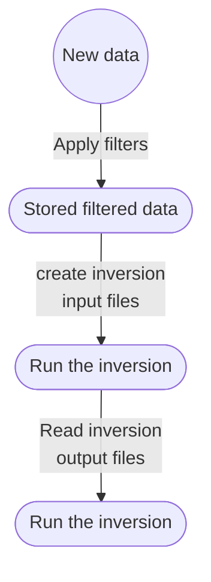

```mermaid
graph TB;
  A((New data)) --> |Apply filters| B[/Stored filtered data/]
  B([Stored filtered data]) --> |create inversion \ninput files| C([Run the inversion])
  C([Run the inversion]) --> |Read inversion \noutput files| D([Run the inversion])

  style B shape:trapezoid
```

```mermaid
flowchart TD
    id1[/This is the text in the box/]
```