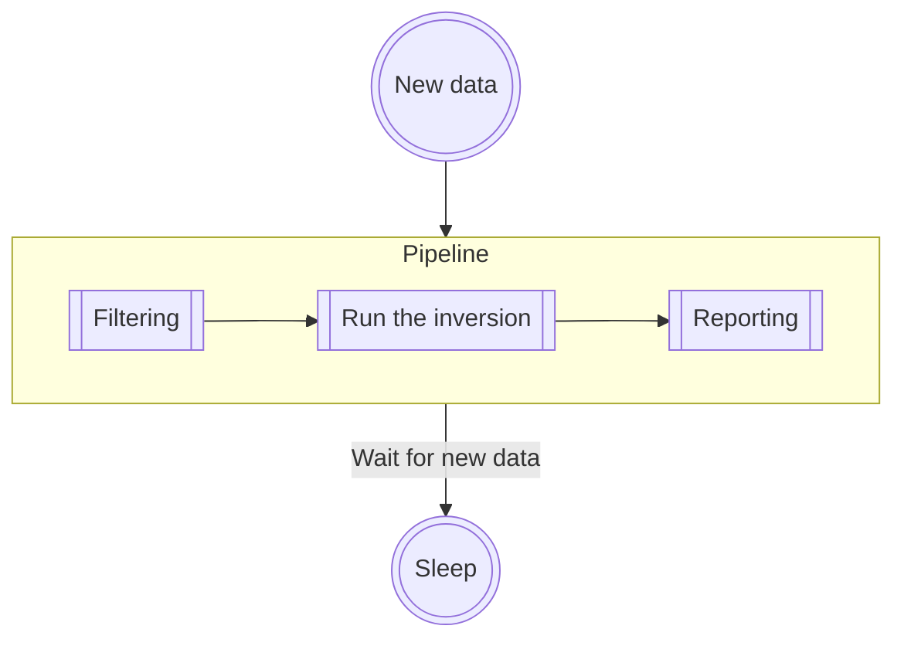
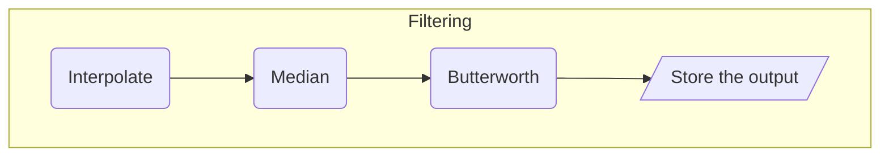
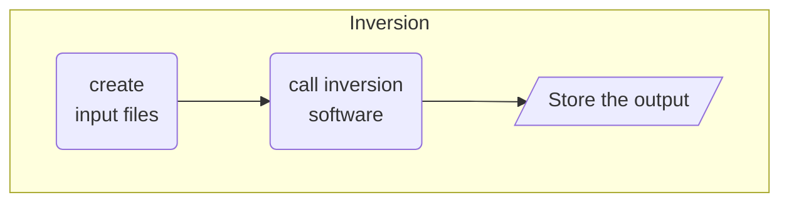
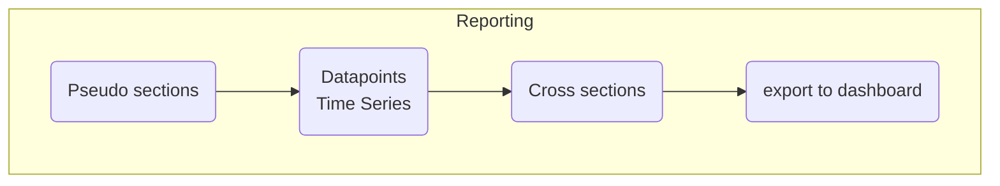

```mermaid
graph TD;

    subgraph Pipeline
        
        B[[Filtering]]
        B --> C[[Run the inversion]]
        C --> D[[Reporting]]
    end


    A(((New data))) --> Pipeline
    Pipeline --> |Wait for new data| E(((Sleep)))


```

```mermaid
graph TD;

    B_FMV(Interpolate)
    B_FMV --> B_M(Median)
    B_M --> B_BW(Butterworth)
    B_BW --> B_F[/Store the output/]

    subgraph Filtering 
        direction LR
        B_FMV
        B_M
        B_BW
        B_F
    end

```

```mermaid
graph TD;

    C_WF(create \n input files)
    C_WF --> C_EXEC("call inversion \nsoftware")
    C_EXEC --> C_F[/Store the output/]
    
    subgraph Inversion
        direction LR
        C_WF
        C_EXEC
        C_F
    end

```

```mermaid
graph TD;

    D_R2D(Pseudo sections)
    D_R2D --> D_R1D(Datapoints \n Time Series)
    D_R1D --> D_I2D(Cross sections)
    D_I2D --> D_DASH(export to dashboard)

    subgraph Reporting
        direction LR
        D_R2D
        D_R1D
        D_I2D
        D_DASH
    end

```